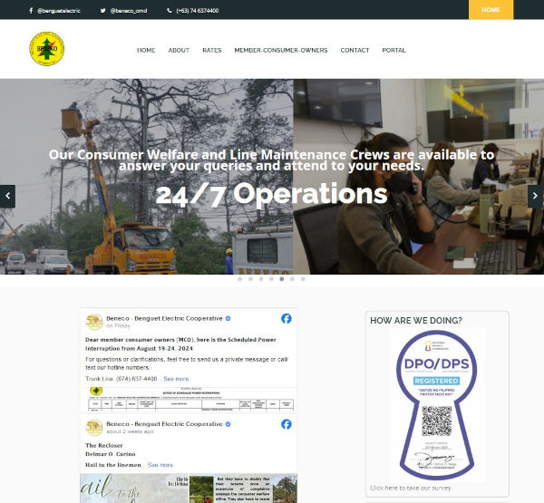
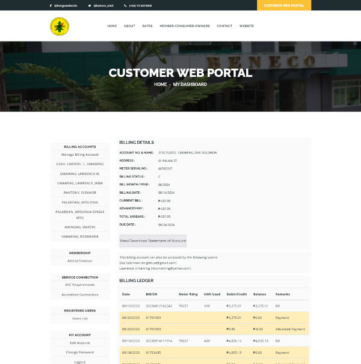
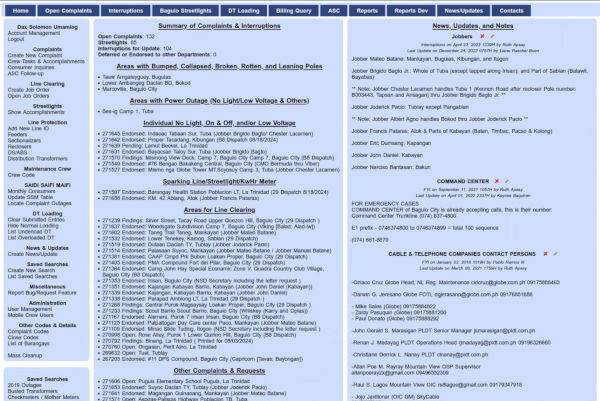
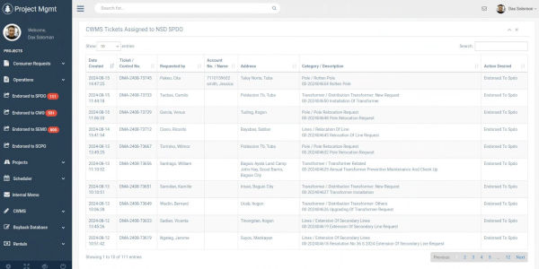
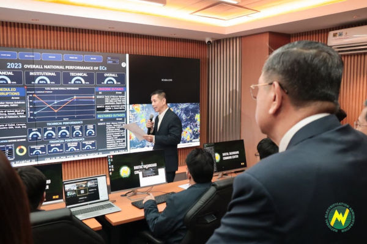
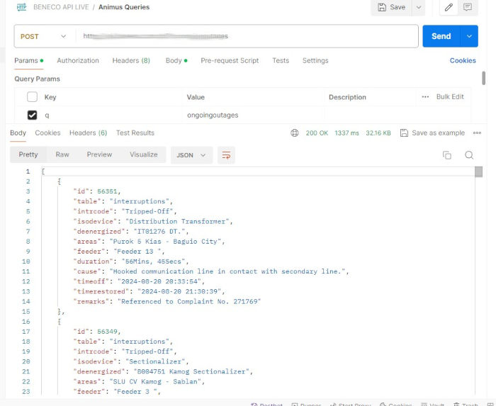
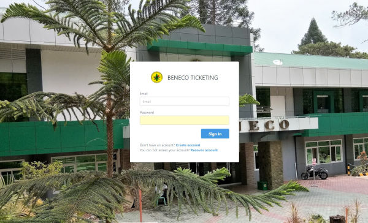
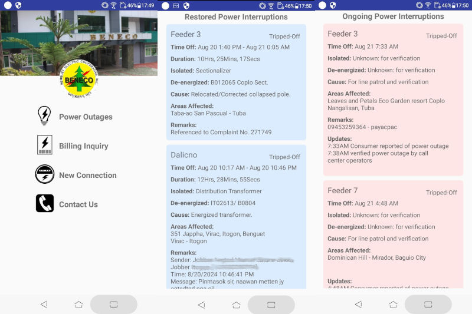

## Hi there 👋

With extensive experience in web and application development, I have a robust skill set in software development for the web and desktop applications. My expertise extends to API and mobile application development, having created REST API servers and Android applications. I am also proficient in Linux server management having transitioned numerous servers from Windows to Ubuntu & Oracle Enterprise Linux. My experience also covers various RDBMS databases such as MySQL/MariaDB, PostgreSQL, and Oracle 12c/19c databases.

# 🗃️ Projects I've Worked On

## ✔️ Corporate Website
Developed and went live in 2020 to replace the old website.

**Repository**: https://github.com/daxumaming/benecowebsite  
**Visibility**: Private, Intellectual Property  
**Status**: in production  
**Live**: https://www.beneco.com.ph  

**Tech Stack**: Ubuntu 22.04, Nginx, PHP, MariaDB

## ✔️ Customer Web Portal
Developed in 2020 to accomodate the needs of Member-Consumer-Owners (MCOs) to view and access their billing records and ledgers remotely during the COVID lockdowns. The portal went live on 2023 after the issue on online billing with the Energy Regulatory Commission was addressed.

**Repository**: https://github.com/daxumaming/cwp  
**Visibility**: Private, Intellectual Property  
**Status**: in production  
**Live**: https://portal.beneco.com.ph  

**Tech Stack**: Ubuntu 22.04, Nginx, PHP, MariaDB

## ✔️ Outage Management System (Simplified)
Conceptualized and created in 2008 in an effort to replace the hand written logbook with a proper software system designed to log calls, consumer concerns, and reported power outages.

**Repository**: https://github.com/daxumaming/oms  
**Visibility**: Private, Intellectual Property  
**Status**: in production  
**Live**: Intranet 

**Tech Stack**: Ubuntu 20.04, Nginx, PHP, MariaDB

## ✔️ Project Management System 
Development initiated in 2018 to centralize the data and tools of electrical engineers from receipt of request, to planning, warehousing, cost estimating, scheduling, and finally the close-out and audit of projects.

**Repository**: https://github.com/daxumaming/pms  
**Visibility**: Private, Intellectual Property  
**Status**: in production  
**Live**: Intranet 

**Tech Stack**: Oracle Enteprise Linux 7, Nginx, PHP, Oracle 19c

## ✔️ Digital Dashboard API
Designed, developed, and completed in one month in 2024 in support of the project of the energy regulator. The API server pulls outage, warehouse, reliability indices, rates, and other pertinent data from the electric cooperative and presented via MS Power BI at the command center of the national energy regulator.

**Repository**: https://github.com/daxumaming/apineaddcc  
**Visibility**: Private, Intellectual Property  
**Status**: in production  
**Live**: https://ddcc.beneco.com.ph   
**News Article**: https://www.beneco.com.ph/article.php?id=147  

**Tech Stack**: Ubuntu 22.04, Nginx, PHP, Oracle 19c, MariaDB, MS SQL

## ✔️ REST API
REST API used to query outage, billing, consumer, and meter data. Used by mobile (Android) applications and web servers.

**Repository**: https://github.com/daxumaming/benecoapi  
**Visibility**: Private, Intellectual Property  
**Status**: in production  

**Tech Stack**: Ubuntu 22.04, Nginx, PHP, Oracle 19c, MariaDB, MS SQL

## ✔️ Ticketing
Manage requests and log accomplishments through a ticketing system.

**Repository**: https://github.com/daxumaming/benecoticketing  
**Visibility**: Private, Intellectual Property  
**Status**: in production  

**Tech Stack**: Ubuntu 22.04, Nginx, PHP, MariaDB

## ✔️ Project Animus
An Android project using Java to query the REST API for scheduled/unscheduled/restored power outages, meter/billing status, and consumer data.

**Repository**: deleted, project no longer being updated even though the app is still in use.  
**Visibility**: n/a  
**Status**: in use, to be replaced    

**Tech Stack**: Android, Java

## 😐 CWP DB Admin
A C# + WPF desktop utility to fetch and process data from an Oracle Database and inserted to a MariaDB database.

**Repository**: https://github.com/daxumaming/cwp_admin  
**Visibility**: Private, Intellectual Property  
**Status**: decommissioned    

**Tech Stack**: C#, WPF, Oracle 19c, MariaDB

## 😐 Request Action System
A Java Spring project to track requests of employees and accomplishments of the IT office. This was decommissioned in favor of the Ticketing System.

**Repository**: https://github.com/daxumaming/RAS-Request-Action-System  
**Visibility**: Private, Intellectual Property  
**Status**: decommissioned    

**Tech Stack**: Windows 10 Pro, Tomcat, Spring, Java

## 😐 Blockmetering System
My first website project in PHP. A web based system to track poles, distribution transformers, mother meters, and primary/secondary/service lines. This software system is used to calculate the technical systems loss of a particular area and determine possible pilferage if the calculated technical systems loss does not match the actual systems loss. This project was decommissioned in 2018.

**Repository**: none  
**Visibility**: n/a  
**Status**: decommissioned    

**Tech Stack**: Ubuntu 14.04, PHP, Apache, MySQL

## 😐 Blockmetering DB Admin
C# + Winform desktop utility to process data in MDB file and upload said data to the MySQL database of the Blockmetering System.

**Repository**: none  
**Visibility**: n/a  
**Status**: decommissioned    

**Tech Stack**: C#, Winform

## 😐 AGMA Raffle 
A raffle desktop application developed in C# + WPF used during the Annual General Membership Assembly in 2021, 2022, and 2023.

**Repository**: https://github.com/daxumaming/BENECO-AGMA-2021-Online-Raffle  
**Visibility**: Public  
**Status**: decommissioned    

**Tech Stack**: C#, WPF, MariaDB

## ❌ Human Resource Information System
An HR System developed in C# + Winform. It creates and tracks leaves, overtime, gate passes, daily schedules, and gathers check-in/check-out biometric logs. It will generate daily, weekly, bi-weekly, and monthly attendance reports with calculated overtime hours and night shift differential. Was not deployed to production in favor of a third-party subscription service.

**Repository**: none  
**Visibility**: n/a  
**Status**: undeployed  

**Tech Stack**: C#, Winform, MetroUI

## ❌ AGMA Voting System
A voting system to be used at the 2020 Annual General Membership Assembly during COVID lockdowns. This was undeployed/unused due to the board of directors decision to use the manual method of raised hands.

**Repository**: https://github.com/daxumaming/votingsystem  
**Visibility**: Private, Intellectual Property  
**Status**: undeployed  

**Tech Stack**: Ubuntu 22.04, Nginx, PHP, MariaDB

## ❌ MICS Planner
Project tracker for the IT office featuring project and tasks tracking, Gantt chart, and Kanban view. Generates reports on the fly. Unfinished due to sudden immigration to Canada 🇨🇦. 

**Repository**: https://github.com/daxumaming/benecoplanner  
**Visibility**: Private, Intellectual Property  
**Status**: undeployed  

**Tech Stack**: Ubuntu 22.04, Nginx, PHP, MariaDB

## ❌ Mobile Crew
An Android application that interacts with the Outage Management System via the REST API to access endorsed job orders and log accomplishments and materials used. Target users are line maintenance workers. Unfinished due to sudden immigration to Canada 🇨🇦. 

**Repository**: https://github.com/daxumaming/benecomobilecrew  
**Visibility**: Private, Intellectual Property  
**Status**: undeployed  

**Tech Stack**: Android, Kotlin

<!--
**daxumaming/daxumaming** is a ✨ _special_ ✨ repository because its `README.md` (this file) appears on your GitHub profile.

Here are some ideas to get you started:

- 🔭 I’m currently working on ...
- 🌱 I’m currently learning ...
- 👯 I’m looking to collaborate on ...
- 🤔 I’m looking for help with ...
- 💬 Ask me about ...
- 📫 How to reach me: ...
- 😄 Pronouns: ...
- ⚡ Fun fact: ...
-->
