## Hi there 👋

With extensive experience in web and application development, I have a robust skill set in software development for the web and desktop applications. My expertise extends to API and mobile application development, having created REST API servers and Android applications. I am also proficient in Linux server management having transitioned numerous servers from Windows to Ubuntu & Oracle Enterprise Linux. My experience also covers various RDBMS databases such as MySQL/MariaDB, PostgreSQL, and Oracle 12c/19c databases.

# 🗃️ Projects I've Worked On

## ✔️ Corporate Website
Developed and went live in 2020 to replace the old website.

**Repository**: https://github.com/daxumaming/benecowebsite  
**Visibility**: Private, Intellectual Property  
**Status**: in production  
**Live**: https://www.beneco.com.ph  

**Tech Stack**: Ubuntu 22.04, Nginx, PHP, MariaDB

## ✔️ Customer Web Portal
Developed in 2020 to accomodate the needs of Member-Consumer-Owners (MCOs) to view and access their billing records and ledgers remotely during the COVID lockdowns. The portal went live on 2023 after the issue on online billing with the Energy Regulatory Commission was addressed.

**Repository**: https://github.com/daxumaming/cwp  
**Visibility**: Private, Intellectual Property  
**Status**: in production  
**Live**: https://portal.beneco.com.ph  

**Tech Stack**: Ubuntu 22.04, Nginx, PHP, MariaDB

## ✔️ Outage Management System (Simplified)
Conceptualized and created in 2008 in an effort to replace the hand written logbook with a proper software system designed to log calls, consumer concerns, and reported power outages.

**Repository**: https://github.com/daxumaming/oms  
**Visibility**: Private, Intellectual Property  
**Status**: in production  
**Live**: Intranet 

**Tech Stack**: Ubuntu 20.04, Nginx, PHP, MariaDB

## ✔️ Project Management System 
Development initiated in 2018 to centralize the data and tools of electrical engineers from receipt of request, to planning, warehousing, cost estimating, scheduling, and finally the close-out and audit of projects.

**Repository**: https://github.com/daxumaming/pms  
**Visibility**: Private, Intellectual Property  
**Status**: in production  
**Live**: Intranet 

**Tech Stack**: Oracle Enteprise Linux 7, Nginx, PHP, Oracle 19c

## ✔️ Digital Dashboard API
Designed, developed, and completed in one month in 2024 in support of the project of the energy regulator. The API server pulls outage, warehouse, reliability indices, rates, and other pertinent data from the electric cooperative and presented via MS Power BI at the command center of the national energy regulator.

**Repository**: https://github.com/daxumaming/apineaddcc  
**Visibility**: Private, Intellectual Property  
**Status**: in production  
**Live**: https://ddcc.beneco.com.ph   
**News Article**: https://www.beneco.com.ph/article.php?id=147  

**Tech Stack**: Ubuntu 22.04, Nginx, PHP, Oracle 19c, MariaDB, MS SQL

## ✔️ REST API
REST API used to query outage, billing, consumer, and meter data. Used by mobile (Android) applications and web servers.

**Repository**: https://github.com/daxumaming/benecoapi  
**Visibility**: Private, Intellectual Property  
**Status**: in production  

**Tech Stack**: Ubuntu 22.04, Nginx, PHP, Oracle 19c, MariaDB, MS SQL

## ✔️ Ticketing
Manage requests and log accomplishments through a ticketing system.

**Repository**: https://github.com/daxumaming/benecoticketing  
**Visibility**: Private, Intellectual Property  
**Status**: in production  

**Tech Stack**: Ubuntu 22.04, Nginx, PHP, MariaDB

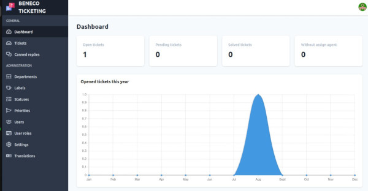

## ✔️ Project Animus
An Android project using Java to query the REST API for scheduled/unscheduled/restored power outages, meter/billing status, and consumer data.

**Repository**: deleted, project no longer being updated even though the app is still in use.  
**Visibility**: n/a  
**Status**: in use, to be replaced    

**Tech Stack**: Android, Java

## ✔️ Oracle DB Sessions Management
A C#/Winforms application that monitors and kills Oracle database sessions. SQL queries are also displayed. Hanged sessions can be killed freeing up resources. Originally developed by IBO.

**Repository**: None   
**Visibility**: n/a  
**Status**: in production  

**Tech Stack**: C#, Winforms, MetroUI  

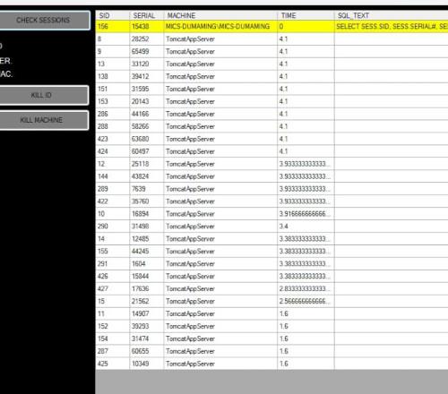

## ✔️ Geographical Information System (GIS)
View the geographical data of the province in QGIS overlayed with real-time location data of field workers. Location data is sent via SMS to an SMS Gateway. An insertdb script is triggered upon receipt to insert said location data to a PostgreSQL database.

**Status**: in production  

**Tech Stack**: Ubuntu 22.04, Windows 10, PostgreSQL, Python, QGIS

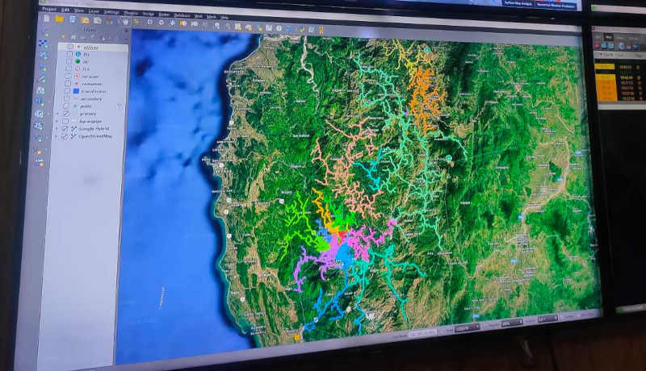
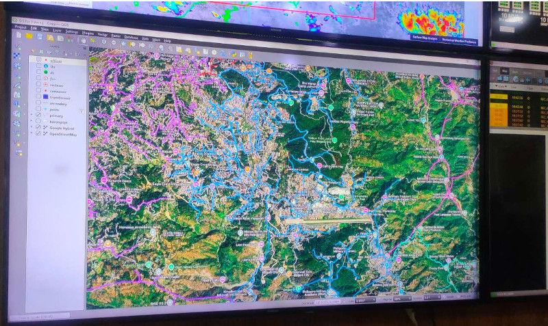
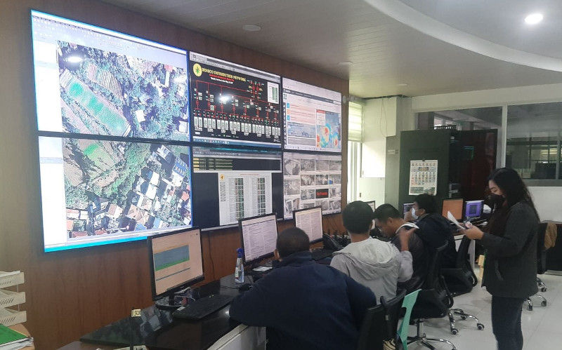
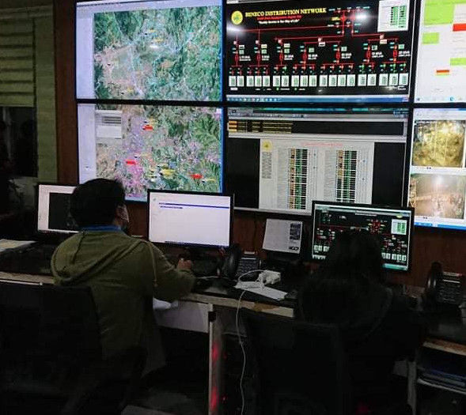

## 😐 CWP DB Admin
A C# + WPF desktop utility to fetch and process data from an Oracle Database and inserted to a MariaDB database.

**Repository**: https://github.com/daxumaming/cwp_admin  
**Visibility**: Private, Intellectual Property  
**Status**: decommissioned    

**Tech Stack**: C#, WPF, Oracle 19c, MariaDB

## 😐 Request Action System
A Java Spring project to track requests of employees and accomplishments of the IT office. This was decommissioned in favor of the Ticketing System.

**Repository**: https://github.com/daxumaming/RAS-Request-Action-System  
**Visibility**: Private, Intellectual Property  
**Status**: decommissioned    

**Tech Stack**: Windows 10 Pro, Tomcat, Spring, Java

## 😐 Blockmetering System
My first website project in PHP. A web based system to track poles, distribution transformers, mother meters, and primary/secondary/service lines. This software system is used to calculate the technical systems loss of a particular area and determine possible pilferage if the calculated technical systems loss does not match the actual systems loss. This project was decommissioned in 2018.

**Repository**: none  
**Visibility**: n/a  
**Status**: decommissioned    

**Tech Stack**: Ubuntu 14.04, PHP, Apache, MySQL

## 😐 Blockmetering DB Admin
C# + Winform desktop utility to process data in MDB file and upload said data to the MySQL database of the Blockmetering System.

**Repository**: none  
**Visibility**: n/a  
**Status**: decommissioned    

**Tech Stack**: C#, Winform

## 😐 AGMA Raffle 
A raffle desktop application developed in C# + WPF used during the Annual General Membership Assembly in 2021, 2022, and 2023.

**Repository**: https://github.com/daxumaming/BENECO-AGMA-2021-Online-Raffle  
**Visibility**: Public  
**Status**: decommissioned    

**Tech Stack**: C#, WPF, MariaDB

## ❌ Human Resource Information System
An HR System developed in C# + Winform. It creates and tracks leaves, overtime, gate passes, daily schedules, and gathers check-in/check-out biometric logs. It will generate daily, weekly, bi-weekly, and monthly attendance reports with calculated overtime hours and night shift differential. Was not deployed to production in favor of a third-party subscription service.

**Repository**: none  
**Visibility**: n/a  
**Status**: undeployed  

**Tech Stack**: C#, Winform, MetroUI

## ❌ AGMA Voting System
A voting system to be used at the 2020 Annual General Membership Assembly during COVID lockdowns. This was undeployed/unused due to the board of directors decision to use the manual method of raised hands.

**Repository**: https://github.com/daxumaming/votingsystem  
**Visibility**: Private, Intellectual Property  
**Status**: undeployed  

**Tech Stack**: Ubuntu 22.04, Nginx, PHP, MariaDB

## ❌ MICS Planner
Project tracker for the IT office featuring project and tasks tracking, Gantt chart, and Kanban view. Generates reports on the fly. Unfinished due to sudden immigration to Canada 🇨🇦. 

**Repository**: https://github.com/daxumaming/benecoplanner  
**Visibility**: Private, Intellectual Property  
**Status**: undeployed  

**Tech Stack**: Ubuntu 22.04, Nginx, PHP, MariaDB

## ❌ Mobile Crew
An Android application that interacts with the Outage Management System via the REST API to access endorsed job orders and log accomplishments and materials used. Target users are line maintenance workers. Unfinished due to sudden immigration to Canada 🇨🇦. 

**Repository**: https://github.com/daxumaming/benecomobilecrew  
**Visibility**: Private, Intellectual Property  
**Status**: undeployed  

**Tech Stack**: Android, Kotlin

# 🗃️ Relevant IT Skills

## ✔️ CyberSecurity
Intermediate knowledge of CyberSecurity with focus on defense of public-facing servers through the use of SIEM (Wazuh), Firewalls (Sophos), Enpoint Security (Seqrite) and other utilities (Fail2Ban) as well as server hardening.

## ✔️ Firewall Administration
Installed, configured, and managed Sophos firewall appliance. This is also where I'ved setup VLANs and VPN.

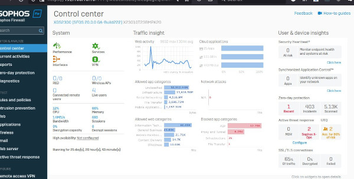

## ✔️ Endpoint Security and Intrusion Detection/Intrusion Prevention Systems (IDS/IPS)
Installation, configuration, and management of Seqrite, an enterprise endpoint security and part of Cybersecurity measures to actively protect our clients on the network.

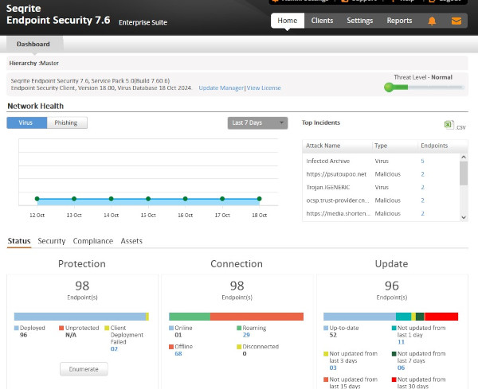

## ✔️ Security Information and Events Management (SIEM)
Installation, configuration, and management of Wazuh, and Open-Source SIEM tool to manage and assess CyberSecurity risks.

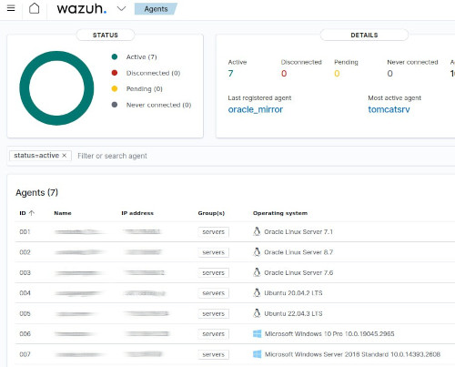
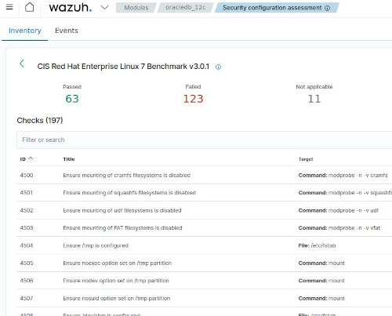
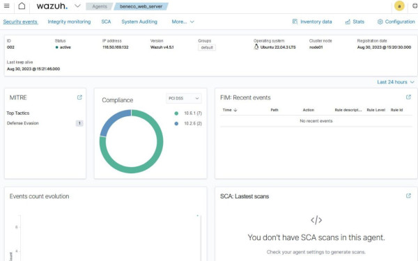

## ✔️ Supervisory Control and Data Acquisition (SCADA)
Trained in the implementation of the Electric Cooperative's SCADA system. Actively provides support on database and network-related issues encountered.

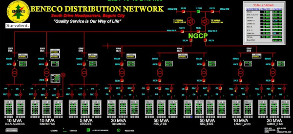

## ✔️ Data Center Management
Setup, configuration, and administration of on-premise data center.

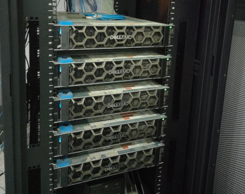

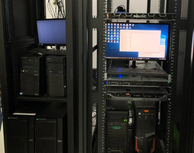

## ✔️ LAN, WAN, and WLAN Networking
Setup, configuration, and administration WAN, LAN, and WLAN networks. Management of multiple ISPs composed of 3 fiber optic and one satellite (Starlink). Configured Load Balancing and Bonding.

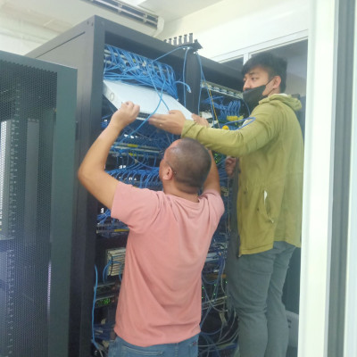
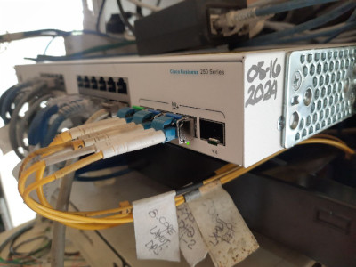
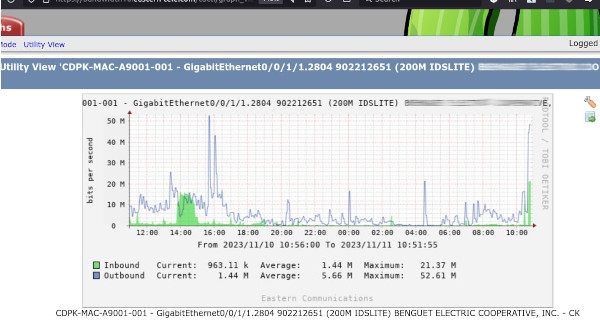
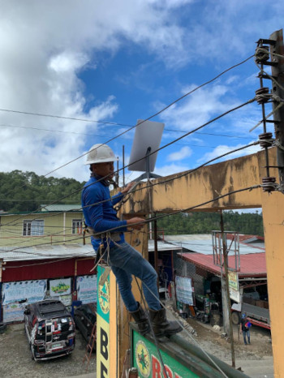
## ✔️ Fiber-optic Cabling and Fusion
Designed, installed, and troubleshooting of fiber-optic communications.

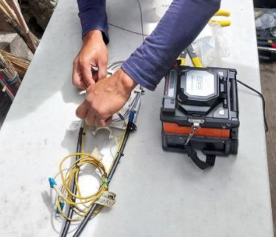
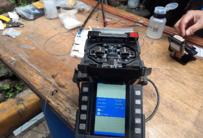

## ✔️ Wireless WAN
Designed wireless redundancy of our WAN with Ubiquiti.

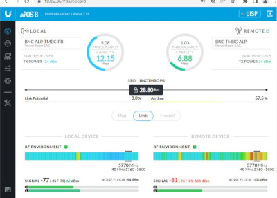

## ✔️ Server and Database Administration
With over sixteen years experience of setting up and rolling into production multiple servers with various purposes. Installed and managed PostgreSQL, Oracle Database, Web Servers (Tomcat and NginX), VM servers, SCADA servers, SIEM servers, ES/IPS servers, and others.

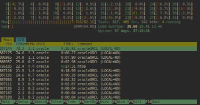
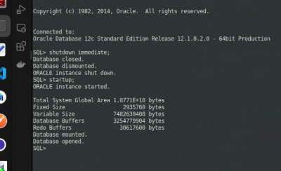
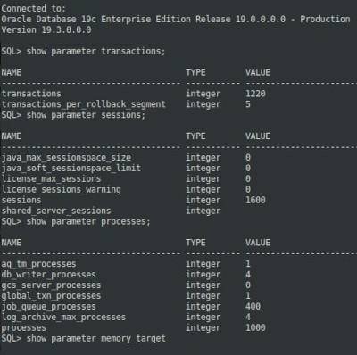

## ✔️ Forward Proxy, Reverse Proxy, and Load Balancing
Utilized Nginx for forward proxy, reverse proxy, and load balancing. Also utilized Dansguardian for content control and filtering of unproductive websites.

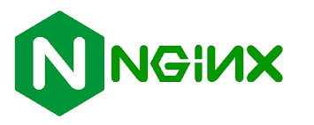
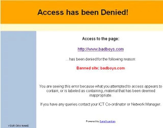

## ✔️ Network Monitoring and Management
Monitoring of network devices such as remote terminal units, client desktops, various server, and other network switches through the use of traditional ping, MetaPing, and Shinken.

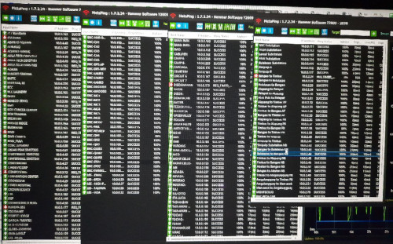
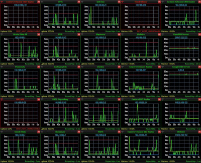
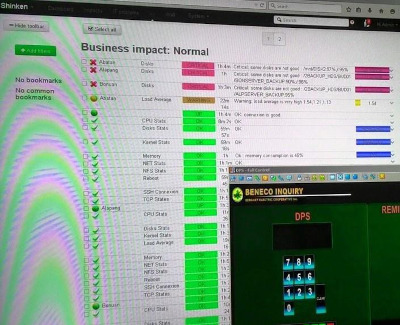

## ✔️ Web Analytics
Analysis of web server performance and user interaction through the use of Google Tag Manager and server analytics utility (GoAccess). 

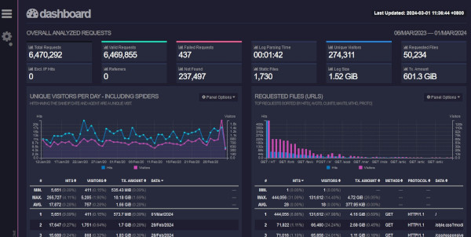

## ✔️ Spring Projects and Tomcat Administration
Caretaker of multiple in-house Java Spring applications for over 5 years. Tasked with upgrading and modifying various modules.

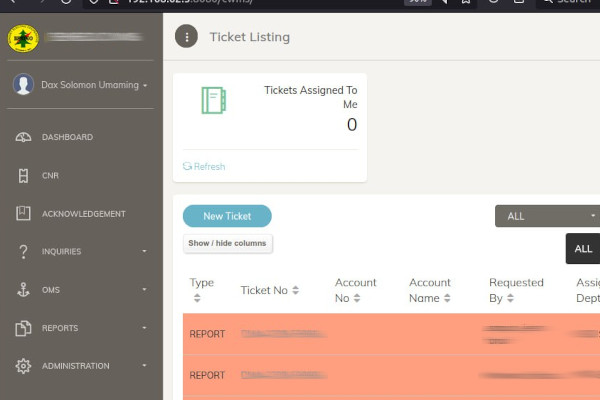

## ✔️ Virtual Machines Management
Over a decade experience with Oracle VirtualBox and QEMU.

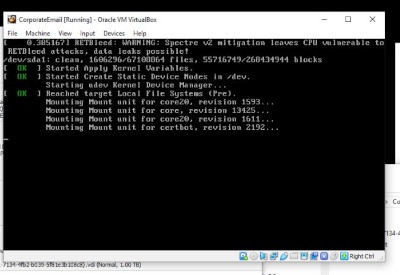

## ✔️ Containers
Been using Docker for containerized applications such as authentication microservices and others built in Django and Laravel.

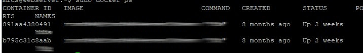

## ✔️ Mail Server Administration
Installed, configured, and managed Zimbra Mail Servers since 2014. Implemented various rules and server hardening to protect the company's email server.

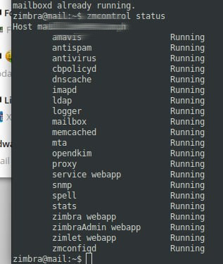

## ✔️ Remote Access
Utilized RustDesk, an open source remote desktop utility which has proven useful during the 2020 pandemic lockdowns. Setup and configured a self-hosted service.

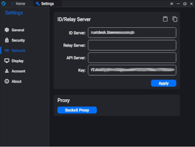

## ✔️ Push-to-Talk over Cellular (POC) Radio
Spearheaded the transition of UHF to POC Radio Communications.

## ✔️ Microsoft Power BI
Utilized Microsoft PowerBI for business intelligence needs of the cooperative.

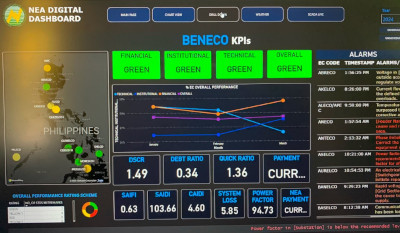

## ✔️ Thin-Client Computing
An R&D initiative to utilize thin-client computing for collection associates that does not require much computing power thereby saving the electric cooperative hundreds of thousands of pesos.

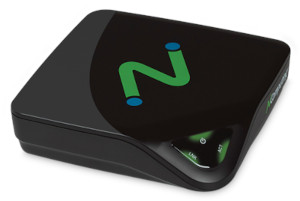

## ✔️ LED Wall Installation and Management
Installed and configured a LED Wall.

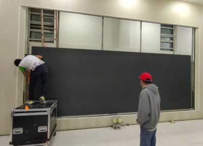

## ✔️ Livestreaming
A minor skill, but important nonetheless. I used OBS Studio and vMix to stream to Facebook, YouTube, and Zoom.

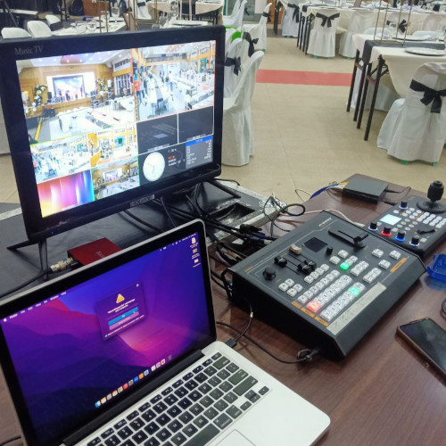

## ✔️ Content Creation and Social Media Management
Yet another minor skill, but was proven crucial in disseminating information to clients and members.

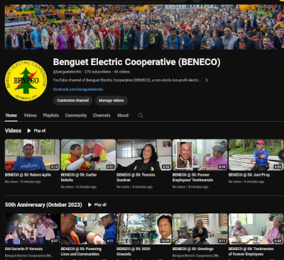

<!--
**daxumaming/daxumaming** is a ✨ _special_ ✨ repository because its `README.md` (this file) appears on your GitHub profile.

Here are some ideas to get you started:

- 🔭 I’m currently working on ...
- 🌱 I’m currently learning ...
- 👯 I’m looking to collaborate on ...
- 🤔 I’m looking for help with ...
- 💬 Ask me about ...
- 📫 How to reach me: ...
- 😄 Pronouns: ...
- ⚡ Fun fact: ...
-->
